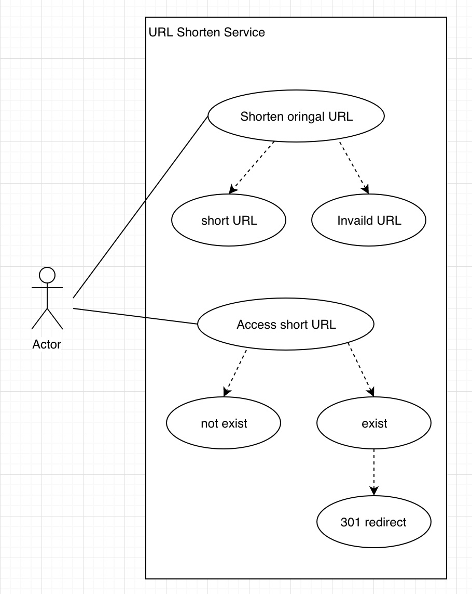

# Tiny URL Website assignment Introduction

Here is a short introduction to describe tiny URL website assignment which implemented by cocotao.

  

#### Part I: Description

- This serivce will supply a URL shorten service to customers. When customer type a valid URL to the service, the service will convert the URL to a short pattern URL and return it to customer. When customer try to access this short URL, it will redirect to original URL address in browser.

- This service implemented by React in frontend and Express in backend, DB is MongoDB, nginx supplied proxy function from frontend to backend and supplied reverse-proxy function from customer access coded short URL in browser to backend for this service.

  

## Part II: Use purpose, use case

##### User purpose

customer could convert an original URL to a short one and could access this short one to original URL in browser.

##### User case

- As a user, I want to input a valid URL and get a coded short URL from URL shorten service.

- As a user, I want to input a invalid URL and get error response.

- As a user, I want to access a coded short URL and then redirect to original URL in browser.

- As a user, I want to get error response if exception happened in internal service.

  

## Part III: Limitation

- Once original URL has been coded to a short URL, this short URL could not be changed.

- Authentication and authorization haven't been enabled.

- Multi-tenancy haven't been enabled.

- User input sanitization haven't been enabled.

  
  

## Attachment

More documatation please see https://github.com/cocotao-sap/urlshortener/blob/master/document.md

## Reference
The project make a reference from https://codeburst.io/creating-custom-url-shortener-with-nodejs-de10bbbb89c7, thanks for the author!
