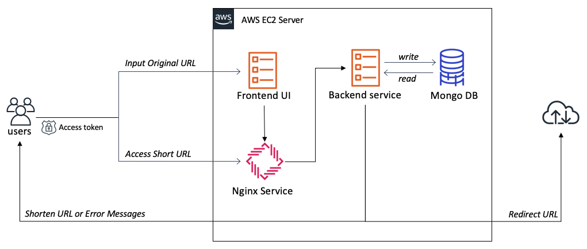
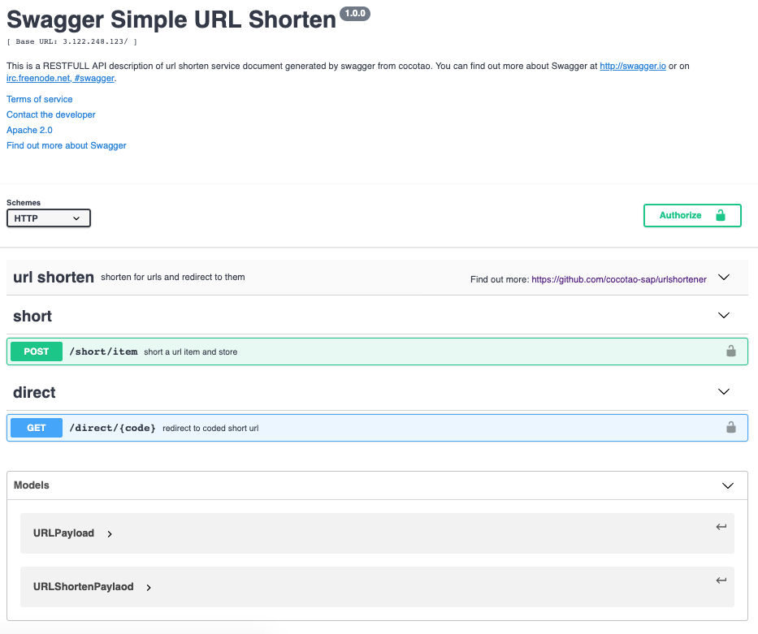
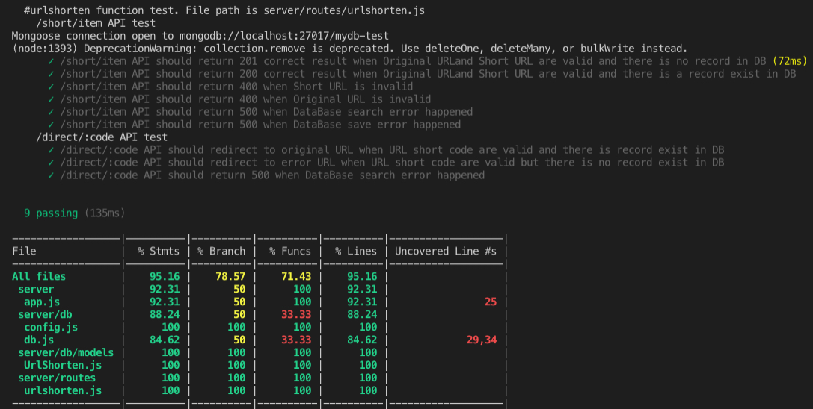

# Tiny URL Website Assignment Document

## PART I: Introduction & design graph & API definition

### Introduce the service itself, its function, the end user and the traffic it could be served.

This service supply a URL shorten service to users. When user type a valid URL to the service, the service will convert the URL to a short pattern URL and return it. When user try to access this short URL, service will redirect to original URL address in browser.

### Service design

Here is a component design graph like below.


### API definition
API definition refer to a swagger file please see in [https://github.com/cocotao-sap/urlshortener/blob/master/swagger/swagger.yaml](https://github.com/cocotao-sap/urlshortener/blob/master/swagger/swagger.yaml).



## PART II: Approach & Go Live & Security Consideration

### Approach

###### The approach you took, the service you compared and why choose these services by the end. What’s the advantages compared one or the other. What’s the limitation for this service? What’s the trade off and why made such decision?

- To approach the frontend UI, compared with React, Vue and Angular, React is chose because it is more easily to write a light and small size UI, and axios could be integrated easily to use RESTFUL APIs. Vue has some limitation because the document of it is not friendly as far as I concerned. Angular is a good framework but more weight than React as I think. For implement a simple UI in this assignment, choose React and needn't to integrate with Redux and rxjs.

- To approach the backend service, compared with Express, KOA2.0 and Nest, Express is chose because there are many examples could be searched in internet, and there is many NodeJS package could be used in express, but some are not available in KOA2.0. Nest need developer have typescript and oriented object knowledges.

- To approach the persistence service, compared with mysql and mongodb, there is no compared, just because mongosse is familiar by developer.

  

### Go Live

##### What should be done before your solution go to production? Any additional features or function that could bring a better user experience in your mind?

- Before solution to production, here are items which need to be achieved.

1. Static code scan.

2. UT test case could test scenarios which supplied by the service.

3. E2E automated test completed and once there is hot-fix, E2E automated test tool could ensure regression test passed.

4. CI/CD pipeline to enable delivery/release new version timely and easily.

5. Set up a scalable environment for service instance.

6. Set up monitor tools if any exception happened known ASAP.

7. Third-party open source license scan.

8. Security/threat modeling analyze

- Additional features

1. If there is an exist record for original URL, could ensure user update a new short URL.

2. Could analyze the original URL whether a un-security URL or legcy URL.

3. Consider the distribution system for service. Like CDN, cache, un-state token management.

4. User favorite and usually use short URL suggestion by AI.

### Security Consideration

##### There some security questions need to be consider.

- Enable https.

- Enable Authentication and Authorization.

- GDPR.

- User input validation in frontend and backend. (XSS)

- Audit log (config change, admin operations)

- Prevent Dos attack, some user input quickly and frequently needs to forbid a time.

- Pay attention that which logs maybe lose security info.

  

## PART III: Source Code and UT coverage

### Source Code

##### The main source code of shorten one original URL.

Refer to: https://github.com/cocotao-sap/urlshortener/blob/master/backend/routes/urlshorten.js

```

app.post("/short/item", async (req, res) => {
	const { originalUrl, shortBaseUrl } = req.body;
	if (!validUrl.isUri(shortBaseUrl) || !validUrl.isUri(originalUrl)) {
		return res
			.status(400)
			.json(
			"Bad Request: invalid Original Url or Short base Url"
		);
	}
	  
	const urlCode = shortid.generate();
	try {
		const item = await UrlShorten.findOne({ originalUrl: originalUrl });
		if (item) {
			res.status(200).json(item);
		} else {
			shortUrl = shortBaseUrl + "/direct/" + urlCode;
			updatedAt = new Date();
			const item = new UrlShorten({
								originalUrl,
								shortUrl,
								urlCode,
								updatedAt
							});
			await item.save();
			res.status(201).json(item);
		}
	} catch (err) {
		res.status(500).json("Internal Server Error: query URL exist failed or shorten URL failed");
	}
});

```

#### The main source code of 301 redirect to original URL.

Refer to: https://github.com/cocotao-sap/urlshortener/blob/master/backend/routes/urlshorten.js

```

app.get("/direct/:code", async (req, res) => {
	const urlCode = req.params.code;
	try {
		const item = await UrlShorten.findOne({ urlCode: urlCode });
		if (item) {
			return res.redirect(301, item.originalUrl);
		} else {
			return res.redirect(errorUrl);
		}
	} catch (err) {
		res.status(500).json("Internal Server Error: query URL exist failed or redirect error");
	}
});

```

#### Nginx configuration

Refer to: https://github.com/cocotao-sap/urlshortener/blob/master/nginx/default.conf

```

server {
	listen 80;
	server_name localhost; 

	location / {
		root /Users/i318440/git/URL-Shortner/frontend/build;
		index index.html index.htm;
	}

	location ^~ /short/{
		proxy_pass http://127.0.0.1:7000;
		proxy_send_timeout 1800;
		proxy_read_timeout 1800;
		proxy_connect_timeout 1800;
		client_max_body_size 2048m;
		proxy_http_version 1.1;
		proxy_set_header Upgrade $http_upgrade;
		proxy_set_header Connection "Upgrade";
		proxy_set_header Host $http_host; # required for docker client's sake
		proxy_set_header X-Real-IP $remote_addr; # pass on real client's IP
		proxy_set_header X-Forwarded-For $proxy_add_x_forwarded_for;
		proxy_set_header X-Forwarded-Proto $scheme;
	}

	location ^~ /direct/ {
		proxy_pass http://127.0.0.1:7000;
		proxy_send_timeout 1800;
		proxy_read_timeout 1800;
		proxy_connect_timeout 1800;
		client_max_body_size 2048m;
		proxy_http_version 1.1;
		proxy_set_header Upgrade $http_upgrade;
		proxy_set_header Connection "Upgrade";
		proxy_set_header Host $http_host; # required for docker client's sake
		proxy_set_header X-Real-IP $remote_addr; # pass on real client's IP
		proxy_set_header X-Forwarded-For $proxy_add_x_forwarded_for;
		proxy_set_header X-Forwarded-Proto $scheme;
	}

	error_page 500 502 503 504 /50x.html;
	location = /50x.html {
		root html;
	}
}

```

  

### UT Coverage

Refer to: https://github.com/cocotao-sap/urlshortener/blob/master/backend/coverage/lcov-report/



  
  

## PART IV: IAM USER

Attach the IAM read access credential at the end.
| Type | Value |
|--|--|
| Account ID |  |
| Account User name |  |
| Password |  |
